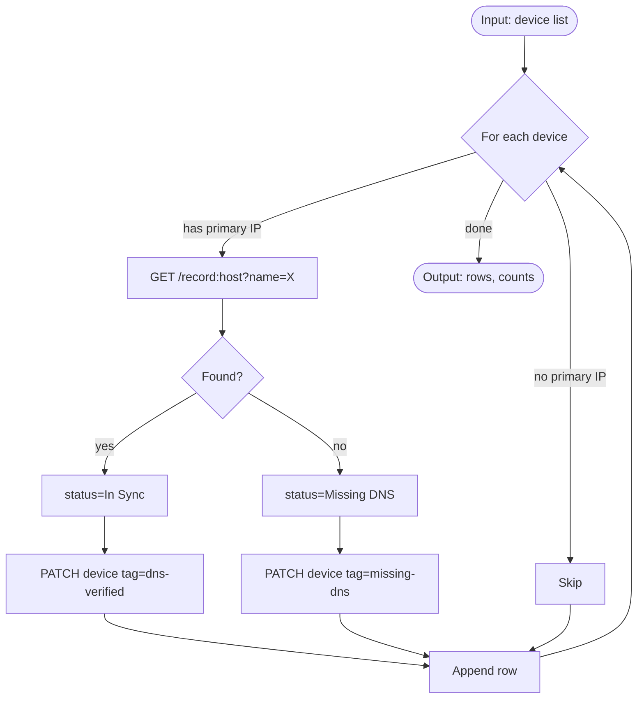
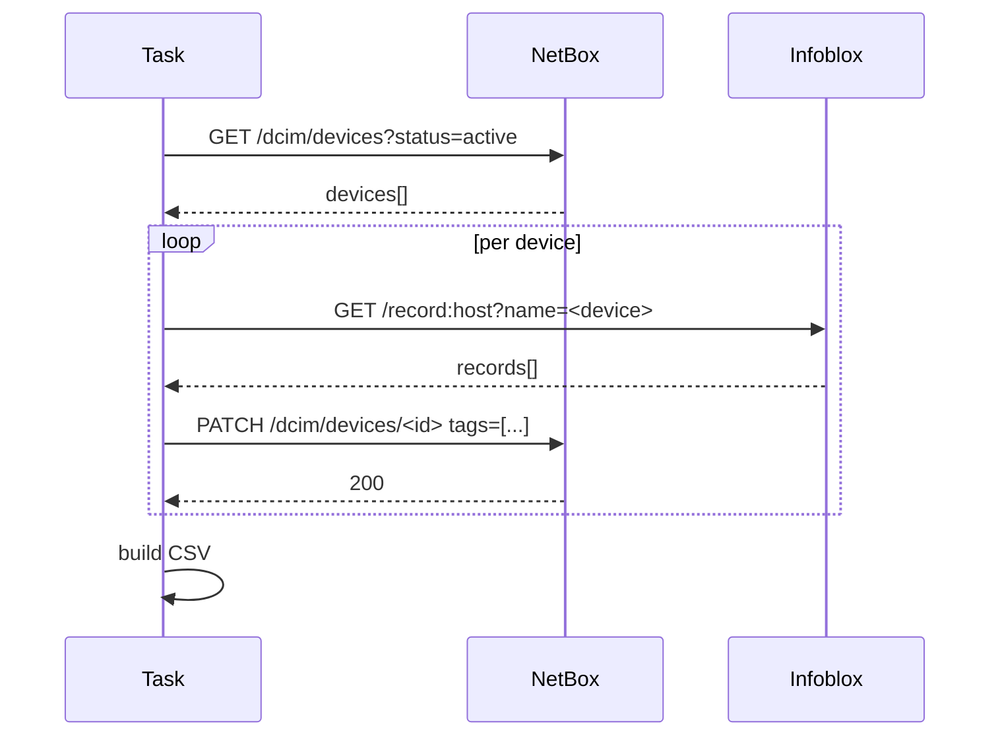
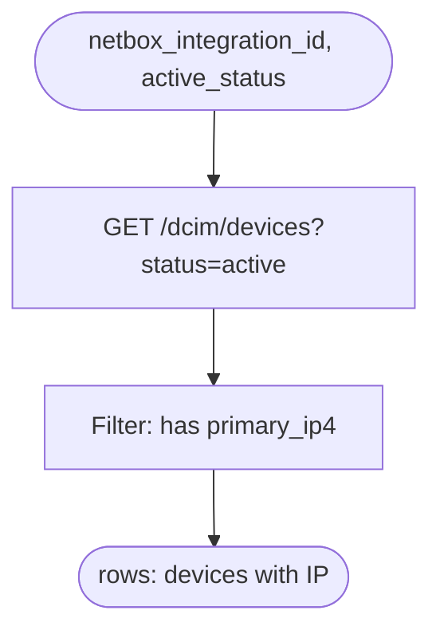
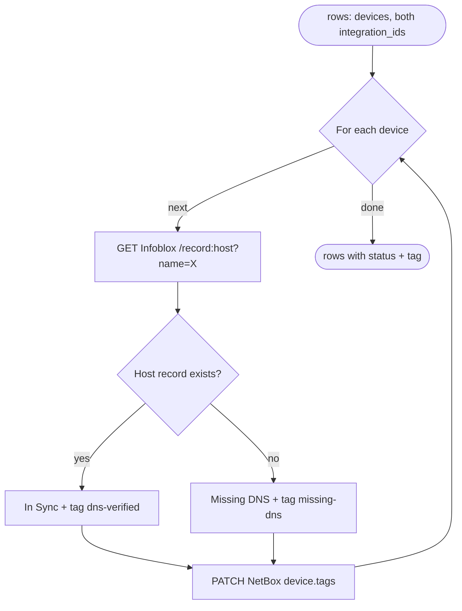
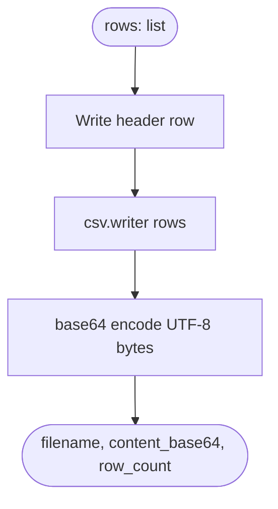

# Skill: authoring the `logic_diagram_mermaid` field

Every `python_snippet` and `transform` snippet MUST carry a Mermaid
source string in `Snippet.LogicDiagramMermaid`. The UI renders it:

- In the snippet's edit dialog, alongside the code.
- In the workflow canvas side panel when the user selects a node that
  references this snippet.

The point is that a user opening the workflow six months later can
read the diagram and understand *what the task does* without reading a
line of Python. If the diagram can't stand alone, it's not serving its
purpose.

## Backend validation (what the 400 catches)

`SnippetService` rejects a create/update with
`logic_diagram_invalid` when:

- The snippet type is `python_snippet`, `python`, `transform`, or
  `jmespath` AND the field is missing / empty.
- The field is non-empty but doesn't start with a Mermaid directive
  (`graph`, `flowchart`, `sequenceDiagram`, `stateDiagram`,
  `classDiagram`, `erDiagram`, `gantt`, `journey`, `gitGraph`, `pie`,
  `mindmap`, `timeline`, …).

The backend does NOT parse the body deeply — that's the renderer's
job. If the diagram is syntactically valid Mermaid but semantically
wrong (missing arrows, orphan nodes), it lands in the UI and the
reviewer catches it visually.

## Preferred shapes

### `flowchart TD` for most tasks

A top-down flowchart reads left-to-right in time and maps naturally
onto a Python function: input node at the top, decision diamonds in
the middle, output at the bottom.

Rules of thumb:

- **Input node as `([...])`** (stadium shape) so it's visually distinct.
- **Output node also `([...])`**.
- **Actions as `[...]`** (rectangles).
- **Decisions as `{...}`** (diamonds).
- **Labels on arrows** when there's branching: `-->|yes|`, `-->|no|`.
- 5-15 nodes is the sweet spot. Fewer → not earning its keep; more →
  the task is too big, split it.

### `sequenceDiagram` when the task coordinates multiple actors

Use a sequence diagram ONLY when the task genuinely has multiple
external actors doing a back-and-forth (e.g., a two-phase commit
across two APIs). Most `python_snippet` tasks are flowcharts.

## Level of detail

The diagram documents **the task**, not the whole workflow. Don't
redraw the DAG inside each snippet's diagram.

**Include**:
- The inputs the task consumes (keys of `get_input()` payload).
- The external calls the task makes (integration + endpoint).
- The decision branches the task takes.
- The output keys the task emits (what appears under `set_output(...)`).

**Exclude**:
- Which upstream node produced the inputs (that's in the DAG).
- Which downstream node consumes the outputs (same).
- Error handling that's identical across all tasks (timeouts, retries).

Keep it at the level a human reviewer needs to spot "wait, shouldn't
this also handle X?" — not every branch of every `try/except`.

## Examples for common task shapes

### `fetch-from-api`

### `reconcile-two-systems`

### `build-csv-attachment`

## When the code changes, the diagram changes

Whenever you call `fw_snippets:update_snippet` with a new `code`, include
an updated `logic_diagram_mermaid` in the same payload. A stale
diagram is worse than no diagram — it misleads reviewers. The backend
doesn't enforce freshness (it can't), so this is on the agent.

If the only change is cosmetic (rename a variable, tweak a log line),
the diagram doesn't need to change — but the `updated_at` on the
snippet still reflects it.

## What NOT to do

- ❌ Paste Python code into the Mermaid field. It fails validation
  (first line is not a directive), and even if it passed, it would
  render as garbage.
- ❌ Copy the workflow DAG into the diagram. The workflow canvas
  already shows the DAG — the task-level diagram is *inside* one node.
- ❌ Emit a stub like `flowchart TD\n    A --> B` that doesn't
  describe anything. That's the scaffold anti-pattern with extra
  steps.
- ❌ Use ASCII-art or PlantUML or sequence diagrams written in prose.
  Only Mermaid (or nothing — for built-in types).
